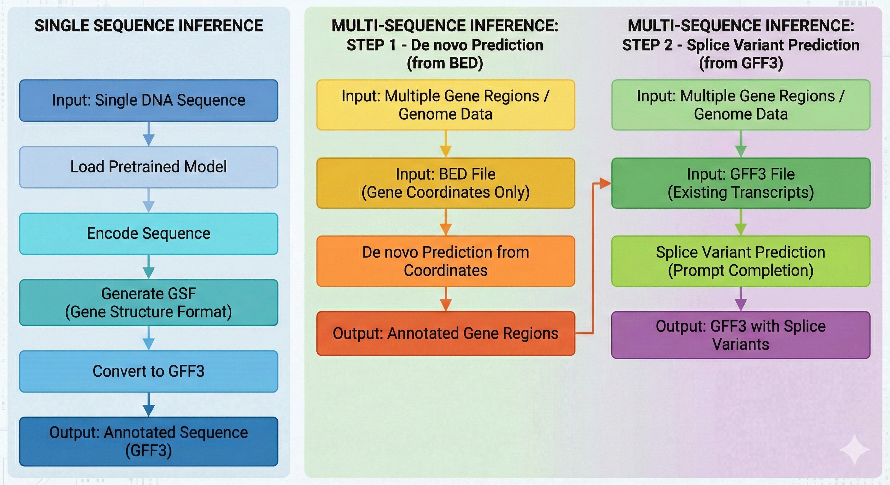

# TransGenic
TransGenic is a transformer for DNA-to-annotation machine translation. Gene annotations specify the structure of a gene within a DNA sequence by providing the composition of each mRNA transcript based on the coordinate locations of sub-genic features, including coding sequences (CDS), introns, and untranslated regions (UTR). TransGenic uses a HyenaDNA encoder with the Longformer decoder to predict a text-based annotation format from raw DNA sequence.



## Table of Contents

- [Architecture](#architecture)
- [Key Features](#key-features)
- [Gene Sentence Format (GSF)](#gene-sentence-format-gsf)
- [Quick Start](#quick-start)
- [Installation](#installation)
- [Pretrained Checkpoints](#pretrained-checkpoints-on-huggingface)
- [Building a DuckDB Database](#building-a-duckdb-database)
- [Inference](#inference)
- [Training](#training)
- [End-to-End Pipeline](#end-to-end-pipeline)
- [Benchmark Results](#benchmark-results)
- [License](#license)

## Architecture

TransGenic uses an encoder-decoder architecture:
- **Encoder**: [HyenaDNA](https://github.com/HazyResearch/hyena-dna), a long-range genomic foundation model capable of processing sequences up to 1 million nucleotides using sub-quadratic convolution operations instead of full attention
- **Decoder**: [Longformer](https://huggingface.co/docs/transformers/model_doc/longformer)-based autoregressive decoder that generates structured text annotations

This design enables the model to capture long-range dependencies in DNA while producing human-readable outputs.

## Key Features

- **De novo annotation**: Generate complete gene structures from unannotated DNA sequences
- **Splice variant prediction**: Predict alternative isoforms via prompt completion given an existing transcript
- **Compact output format**: Gene Sentence Format (GSF) reduces annotation redundancy for efficient generation
- **Plant-focused**: Trained on 9 phylogenetically diverse plant species
- **High accuracy**: Achieves 92% base-level F1 score on *Arabidopsis thaliana* test data

## Gene Sentence Format (GSF)

TransGenic produces output in Gene Sentence Format (GSF), a compact representation modified from the standard Gene Feature Format (GFF). GSF contains the same information as GFF but reduces redundancy and output length, enabling generative decoding within reasonable memory requirements for the decoder's attention mechanisms.

GSF specifies gene model outputs in two parts: a **feature list** and a **transcript list**. The feature list defines the coordinate locations of sub-genic features (CDS, 5'-UTR, and 3'-UTR), and the transcript list defines the composition of each spliced mRNA transcript by referencing features from the feature list.

### GSF Format Structure

GSF consists of two parts separated by `>`:
```
<feature_list>><transcript_list>
```

#### Feature List
Each feature follows the format: `start|type|end|strand|phase`
- **start**: 0-indexed start coordinate (relative to extracted sequence)
- **type**: Feature type with unique number (CDS1, CDS2, five_prime_UTR1, three_prime_UTR1, etc.)
- **end**: End coordinate (exclusive, like Python slicing)
- **strand**: `+` (forward) or `-` (reverse)
- **phase**: Reading frame for CDS features
  - `A` = phase 0 (codon starts at position 0)
  - `B` = phase 1 (codon starts at position 1)
  - `C` = phase 2 (codon starts at position 2)
  - `.` = not applicable (for UTRs)

Multiple features are separated by `;`

#### Transcript List
After the `>` separator, transcripts list their component features:
- Features are separated by `|`
- Multiple transcripts (isoforms) are separated by `;`

### Examples

#### Example 1: Simple single-transcript gene (3 CDS)
**GFF:**
```
Chr1  source  gene  100  400  .  +  .  ID=gene1
Chr1  source  mRNA  100  400  .  +  .  ID=mRNA1
Chr1  source  CDS   100  150  .  +  0  ID=cds1
Chr1  source  CDS   200  280  .  +  2  ID=cds2
Chr1  source  CDS   350  400  .  +  1  ID=cds3
```
**GSF:**
```
0|CDS1|50|+|A;100|CDS2|180|+|C;250|CDS3|300|+|B>CDS1|CDS2|CDS3
```
Note: Coordinates are relative to the extracted sequence (gene start = 0).

#### Example 2: Gene with alternative splicing (2 transcripts)
**GFF:**
```
Chr1  source  gene  100  350  .  +  .  ID=gene1
Chr1  source  mRNA  100  350  .  +  .  ID=mRNA1
Chr1  source  CDS   100  130  .  +  0  ID=cds1
Chr1  source  CDS   180  220  .  +  1  ID=cds2
Chr1  source  CDS   280  350  .  +  0  ID=cds3
Chr1  source  mRNA  180  350  .  +  .  ID=mRNA2
Chr1  source  CDS   180  220  .  +  1  ID=cds2
Chr1  source  CDS   280  350  .  +  0  ID=cds3
```
**GSF:**
```
0|CDS1|30|+|A;80|CDS2|120|+|B;180|CDS3|250|+|A>CDS1|CDS2|CDS3;CDS2|CDS3
```
- First transcript uses all three CDS: `CDS1|CDS2|CDS3`
- Second transcript skips CDS1 (alternative start): `CDS2|CDS3`
- Coordinates are relative to gene start (100 → 0)

#### Example 3: Gene with UTRs
**GFF:**
```
Chr1  source  gene            500  900  .  +  .  ID=gene1
Chr1  source  mRNA            500  900  .  +  .  ID=mRNA1
Chr1  source  five_prime_UTR  500  550  .  +  .  ID=utr5
Chr1  source  CDS             550  650  .  +  0  ID=cds1
Chr1  source  CDS             700  800  .  +  1  ID=cds2
Chr1  source  three_prime_UTR 800  900  .  +  .  ID=utr3
```
**GSF:**
```
0|five_prime_UTR1|50|+|.;50|CDS1|150|+|A;200|CDS2|300|+|B;300|three_prime_UTR1|400|+|.>five_prime_UTR1|CDS1|CDS2|three_prime_UTR1
```
- UTRs use `.` for phase since they are non-coding
- Transcript includes UTRs in the proper order

### Converting GFF3 to GSF

Use `scripts/gff2gsf.py` to convert existing GFF3 annotations to GSF format:

```bash
# Basic usage (output to stdout)
python scripts/gff2gsf.py annotation.gff3

# Save to file
python scripts/gff2gsf.py annotation.gff3 -o output.gsf

# Use absolute coordinates instead of relative
python scripts/gff2gsf.py annotation.gff3 --absolute
```

**Output format** (tab-separated):
```
gene_id    GSF_string
AT1G01010  0|CDS1|150|+|A;200|CDS2|350|+|B>CDS1|CDS2
AT1G01020  0|five_prime_UTR1|50|+|.;50|CDS1|200|+|A>five_prime_UTR1|CDS1
```

## Quick Start

Try TransGenic instantly on Google Colab (no installation required):

[](https://colab.research.google.com/github/JohnnyLomas/transgenic/blob/main/examples/Transgenic_SingleSequence_Colab.ipynb)

### Minimal Example

```python
import torch
from transformers import AutoModel, AutoTokenizer

# Load model and tokenizers from HuggingFace
model_name = "jlomas/HyenaTransgenic-768L12A6-400M"
model = AutoModel.from_pretrained(model_name, trust_remote_code=True)
gsf_tokenizer = AutoTokenizer.from_pretrained(model_name, trust_remote_code=True)
dna_tokenizer = AutoTokenizer.from_pretrained(
    "LongSafari/hyenadna-large-1m-seqlen-hf", trust_remote_code=True
)

# Tokenize DNA sequence
seq = "ATGCGT...your_sequence...TGATGA"
input_ids = dna_tokenizer.batch_encode_plus(
    [seq], return_tensors="pt"
)["input_ids"][:, :-1]

# Generate annotation
model.eval()
if torch.cuda.is_available():
    input_ids = input_ids.to("cuda")
    model.to("cuda")

outputs = model.generate(
    inputs=input_ids,
    max_length=2048,
    num_beams=2,
    do_sample=True
)

# Decode to GSF format
gsf_prediction = gsf_tokenizer.batch_decode(
    outputs.detach().cpu().numpy(),
    skip_special_tokens=True
)[0]
print(gsf_prediction)
# Output: 0|CDS1|150|+|A;200|CDS2|350|+|B>CDS1|CDS2
```

For local development, run notebook examples from the `examples/` folder after setting up an environment as described below.

## Installation

### Quick Install (pip)

If you already have PyTorch installed:

```bash
# Clone and install
git clone https://github.com/wyim-pgl/transgenic.git
cd transgenic
pip install -e .
```

### Full Environment Setup (conda)

For a complete environment with all dependencies, first clone the repository:

```bash
git clone https://github.com/wyim-pgl/transgenic.git
cd transgenic
```

Run `./scripts/check_system.sh` to determine which environment file to use, then follow the appropriate instructions below.

#### Environment Options

- **x86 with NVIDIA GPU** (`environment.yml`): For Linux/Windows with GTX, RTX, or Tesla GPUs. Includes CUDA 12.4.
  ```bash
  conda env create -f environment.yml
  conda activate transgenic
  pip install -e .
  ```

- **x86 CPU only** (`environment.cpu.yml`): For systems without GPU (macOS, VMs, CPU-only machines). Slower but fully functional.
  ```bash
  conda env create -f environment.cpu.yml
  conda activate transgenic
  pip install -e .
  ```

- **GB10 ARM** (`environment.gb10.cuda.yml`): For NVIDIA GB10 Blackwell aarch64 systems with CUDA 13.0. Conda installs only Python and pip; all ML packages are installed via pip with CUDA support.
  ```bash
  conda env create -f environment.gb10.cuda.yml
  conda activate transgenic-gb10
  pip install -e .
  ```

#### Verify CUDA

```bash
python -c "import torch; print(f'CUDA available: {torch.cuda.is_available()}')"
```

## Pretrained Checkpoints on HuggingFace

All checkpoints were trained on 9 plant genomes covering diverse phyla, including dicot, monocot, and moss species. The highest performance on test set evaluation (92% base-level F1 in *Arabidopsis*) was achieved using the 400M parameter model. Both checkpoints used sequences padded with neighboring genomic sequence to the next multiple of 6144 nucleotides.

### Training Data
Nine phylogenetically diverse plant species:
- *Arabidopsis thaliana*, *Glycine max* (Soybean), *Oryza sativa* (Rice)
- *Sorghum bicolor*, *Populus trichocarpa* (Poplar), *Brachypodium distachyon*
- *Vitis vinifera* (Grape), *Setaria italica* (Millet), *Physcomitrella patens* (Moss)

### Available Models

| Model | Parameters | Hidden Size | Layers | Attention Heads | F1 Score |
|-------|------------|-------------|--------|-----------------|----------|
| [HyenaTransgenic-768L12A6-400M](https://huggingface.co/jlomas/HyenaTransgenic-768L12A6-400M) | ~400M | 768 | 12 | 6 | 92% |
| [HyenaTransgenic-512L9A4-160M](https://huggingface.co/jlomas/HyenaTransgenic-512L9A4-160M) | ~160M | 512 | 9 | 4 | - |

### Training Configuration
- **Learning rate**: 5e-5
- **Batch size**: 96 (effective)
- **Loss**: Cross Entropy
- **Mixed precision**: BF16
- **Input length**: Multiples of 6,144nt (max 49,152nt)

### Intended Uses
1. Generate *de novo* annotations for plant DNA sequences containing genes
2. Add alternatively spliced isoforms to known primary mRNA transcripts via prompt completion

## Building a DuckDB Database

TransGenic uses [DuckDB](https://duckdb.org/) as its data storage backend for both training and inference. The database stores genomic sequences paired with their gene structure annotations in GSF format. This section explains how to create databases for different use cases.

### Prerequisites

1. A **genome FASTA file** (`.fa` or `.fasta`) containing the assembled chromosome/scaffold sequences
2. A **sorted GFF3 annotation file** (for training) or a **GFF3/BED file** with gene coordinates (for inference)
3. The `transgenic` package installed (`pip install -e .`)

**Important:** GFF3 files must be sorted using [AGAT](https://github.com/NBISweden/AGAT) before building the database:
```bash
agat_convert_sp_gxf2gxf.pl -g annotation.gff3 -o annotation.sorted.gff3
```

### Database Schema

The `genome2GSFDataset` function creates a `geneList` table with the following columns:

| Column | Type | Description |
|--------|------|-------------|
| `rn` | INT (PK) | Auto-incrementing row number (primary key) |
| `geneModel` | VARCHAR | Gene identifier from GFF3 `ID=` attribute |
| `start` | INT | 0-indexed start of the extracted sequence region in the chromosome |
| `fin` | INT | End of the extracted sequence region (exclusive, Python-style) |
| `strand` | VARCHAR | Gene strand: `+` or `-` |
| `chromosome` | VARCHAR | Chromosome/scaffold name (with optional species prefix, e.g., `Zm_Chr01`) |
| `sequence` | VARCHAR | Extracted DNA sequence (gene + flanking buffer) |
| `gff` | VARCHAR | GSF-formatted annotation string (NULL in predict mode) |
| `static_fpb` | INT | Static 5' flanking buffer size (bp) |
| `static_tpb` | INT | Static 3' flanking buffer size (bp) |
| `five_prime_buf` | INT | Random 5' buffer offset for training augmentation |
| `three_prime_buf` | INT | Random 3' buffer offset for training augmentation |

### Building a Training Database

Training databases include full GSF annotations (the `gff` column) as labels for supervised learning. You can append multiple genomes to the same database by calling `genome2GSFDataset` repeatedly.

```python
from transgenic.datasets.preprocess import genome2GSFDataset

# Build a training database from Arabidopsis
genome2GSFDataset(
    genome="Arabidopsis_thaliana.fa",
    gff3="Arabidopsis_thaliana.sorted.gff3",
    db="training.db",
    anoType="gff",          # Input format: "gff" for GFF3, "bed" for BED
    mode="train",           # "train" includes GSF labels; "predict" stores only sequences
    maxLen=49152,           # Skip genes longer than 49,152bp (8x6144 = max encoder input)
    addExtra=200,           # Random 0-200bp buffer on each side (helps model learn UTR boundaries)
    staticSize=6144,        # Pad sequences to multiples of 6,144bp (encoder chunk size)
    addRC=True,             # Add reverse-complement copies for data augmentation
    addRCIsoOnly=True,      # Only add RC for genes with alternative splicing (>1 transcript)
    clean=True              # Validate: skip genes without proper start/stop codons or frame errors
)

# Append a second genome to the same database
genome2GSFDataset(
    genome="Oryza_sativa.fa",
    gff3="Oryza_sativa.sorted.gff3",
    db="training.db",       # Same database file -- rows are appended
    anoType="gff",
    mode="train",
    maxLen=49152,
    addExtra=200,
    staticSize=6144,
    addRC=True,
    addRCIsoOnly=True,
    clean=True
)
```

**Parameter guide:**

| Parameter | Training | Inference | Notes |
|-----------|----------|-----------|-------|
| `mode` | `"train"` | `"predict"` | Train includes GSF labels |
| `addExtra` | 100-300 | 0 | Random buffer teaches model to find UTR boundaries |
| `addRC` | `True` | `False` | RC augmentation doubles training data for rare splice variants |
| `addRCIsoOnly` | `True`/`False` | N/A | `True` = only augment multi-isoform genes |
| `clean` | `True` | `False` | Filters out genes with invalid CDS (missing start/stop, broken frame) |
| `maxLen` | 49152 | 49152 | 49,152bp = 8 chunks of 6,144bp (max HyenaDNA input) |
| `staticSize` | 6144 | 6144 | Must match model's encoder chunk size |

### Building an Inference Database

Inference databases contain sequences to annotate but no GSF labels. You can provide either a GFF3 or BED file defining the gene regions:

```python
# From GFF3 (gene coordinates from existing annotation)
genome2GSFDataset(
    genome="new_genome.fa",
    gff3="gene_regions.sorted.gff3",
    db="inference.db",
    anoType="gff",
    mode="predict"          # Only stores sequences, no GSF labels
)

# From BED file (simple coordinate list)
genome2GSFDataset(
    genome="new_genome.fa",
    gff3="gene_regions.bed",
    db="inference.db",
    anoType="bed",           # BED format: chr, start, end, name, score, strand
    mode="predict"
)
```

### Using the Database Creation Script

For building databases from the command line without writing Python, use `scripts/create_database.py`:

```bash
# Single species (training with augmentation)
python scripts/create_database.py \
    --fasta Arabidopsis_thaliana.fa \
    --gff Arabidopsis_thaliana.sorted.gff3 \
    --output train.db --mode train \
    --add-extra 200 --add-rc-iso-only --clean

# Multi-species (9 plant genomes in one command)
python scripts/create_database.py \
    --fasta At.fa Os.fa Gm.fa Sb.fa Pt.fa Bd.fa Vv.fa Si.fa Pp.fa \
    --gff   At.gff3 Os.gff3 Gm.gff3 Sb.gff3 Pt.gff3 Bd.gff3 Vv.gff3 Si.gff3 Pp.gff3 \
    --output 9species_train.db --mode train \
    --add-extra 200 --add-rc-iso-only --clean

# Inference database (no labels)
python scripts/create_database.py \
    --fasta Zea_mays.fa \
    --gff Zea_mays.sorted.gff3 \
    --output predict.db --mode predict

# Append more species to an existing database
python scripts/create_database.py \
    --fasta Zea_mays.fa \
    --gff Zea_mays.sorted.gff3 \
    --output 9species_train.db --mode train --append
```

**Key options:**

| Option | Default | Description |
|--------|---------|-------------|
| `--fasta` | (required) | One or more genome FASTA files |
| `--gff` | (required) | Matching sorted GFF3 files (same count and order as `--fasta`) |
| `--output` | (required) | Output DuckDB file path |
| `--mode` | `train` | `train` (includes GSF labels) or `predict` (sequences only) |
| `--add-extra` | `0` | Random flanking buffer in bp (recommended: 200 for training) |
| `--add-rc` | off | Add reverse complement copies of all genes |
| `--add-rc-iso-only` | off | Add RC only for multi-isoform genes (mutually exclusive with `--add-rc`) |
| `--clean` | off | Validate CDS integrity and skip invalid genes |
| `--static-size` | `6144` | Pad sequences to multiples of this size |
| `--max-len` | `49152` | Skip genes exceeding this padded length |
| `--append` | off | Append to existing database instead of overwriting |
| `--species-prefix` | auto | Prefix(es) for chromosome names (see below) |
| `--no-prefix` | off | Disable chromosome prefix entirely |

#### Species Prefix (Chromosome Naming)

When building multi-species databases, different species often share generic chromosome names like `Chr01`, `Chr02`, etc. To prevent collisions, `create_database.py` automatically prepends a species prefix derived from the FASTA filename:

```
Zm.fa  →  Chr01 becomes Zm_Chr01
At.fa  →  Chr01 becomes At_Chr01
```

This is the **default behavior** — no extra flags needed:

```bash
# Auto-prefix: At.fa → At_Chr01, Os.fa → Os_Chr01, ...
python scripts/create_database.py \
    --fasta At.fa Os.fa Zm.fa \
    --gff   At.gff3 Os.gff3 Zm.gff3 \
    --output 3species.db --mode train
```

You can override the auto-derived prefix with explicit names:

```bash
# Manual prefix: Arabidopsis_Chr01, Rice_Chr01, Maize_Chr01
python scripts/create_database.py \
    --fasta At.fa Os.fa Zm.fa \
    --gff   At.gff3 Os.gff3 Zm.gff3 \
    --species-prefix Arabidopsis Rice Maize \
    --output 3species.db --mode train
```

Or disable prefixing entirely (original behavior):

```bash
# No prefix: chromosome names stored as-is from the FASTA/GFF3
python scripts/create_database.py \
    --fasta Zm.fa --gff Zm.gff3 \
    --output single.db --mode train --no-prefix
```

The `speciesPrefix` parameter is also available in the Python API:

```python
genome2GSFDataset(
    genome="Zm.fa", gff3="Zm.sorted.gff3", db="multi.db",
    mode="train", speciesPrefix="Zm"   # Chr01 → Zm_Chr01
)
```

### Using the Inference CLI Script

For a complete inference pipeline (database creation + model inference + GFF3 output), use the command-line script:

```bash
# Basic usage (auto-sorts GFF3, creates temp DB, runs inference, cleans up)
python src/run_genome_annotation.py genome.fa genes.gff3 -o output.gff3

# With options
python src/run_genome_annotation.py genome.fa genes.gff3 \
    -o output.gff3 \
    --device cuda \
    --batch_size 4 \
    --num_workers 4 \
    --compile \
    --no_sort              # Skip AGAT sorting if GFF3 is already sorted
```

### Inspecting the Database

You can query the DuckDB database directly to verify its contents:

```python
import duckdb

con = duckdb.connect("training.db", read_only=True)

# Count total entries
print(con.sql("SELECT COUNT(*) FROM geneList").fetchone())

# View a sample entry
print(con.sql("SELECT geneModel, chromosome, strand, LENGTH(sequence) as seqlen FROM geneList LIMIT 5").df())

# Check sequence length distribution
print(con.sql("SELECT LENGTH(sequence) as seqlen, COUNT(*) as n FROM geneList GROUP BY seqlen ORDER BY seqlen").df())

con.close()
```

## Inference

The general outline of an inference workflow is:
1. Create a [DuckDB](https://duckdb.org/) database from a FASTA and a [GFF3|BED] file which describes the sequences to be used for prediction
2. Initialize a [PyTorch Dataset and DataLoader](https://pytorch.org/tutorials/beginner/basics/data_tutorial.html) for the database
3. Generate annotations using `model.generate`
4. Convert GSF outputs to a GFF3 formatted output file

### Example Notebooks

**[Single Sequence Inference](https://github.com/JohnnyLomas/transgenic/blob/main/examples/Transgenic_SingleSequence.ipynb)**
- Annotate a single DNA sequence using a pretrained model
- Basic workflow: load model → encode sequence → generate GSF → convert to GFF3

**[Multi-Sequence Inference](https://github.com/JohnnyLomas/transgenic/blob/main/examples/Transgenic_MultiSequence.ipynb)**
- Batch annotation of multiple gene regions from a genome
- De novo prediction from BED file (gene coordinates only)
- Splice variant prediction from GFF3 file (prompt completion with existing transcript)

### Example Data Files

The `examples/` folder includes *Arabidopsis thaliana* chromosome 4 data files for testing:

| File | Description |
|------|-------------|
| `ATH_Chr4.fas` | FASTA sequence file for chromosome 4 |
| `ATH_Chr4_gene.bed` | BED file with gene coordinates |
| `ATH_Chr4.sorted.gff3` | Sorted GFF3 annotation file |

### GFF3 Sorting Requirement

GFF3 files must be sorted with [AGAT](https://github.com/NBISweden/AGAT) before use (see [Prerequisites](#prerequisites)):

```bash
agat_convert_sp_gxf2gxf.pl -g annotation.gff3 -o annotation.sorted.gff3
```

## Training

Training scripts are located in the [`train/`](https://github.com/JohnnyLomas/transgenic/tree/main/train) folder. These scripts use the [Accelerate](https://huggingface.co/docs/accelerate) library for distributed training and [Weights & Biases](https://wandb.ai/) for experiment tracking.

### Training Scripts

| Script | Description |
|--------|-------------|
| `train_HyenaTransgenic.py` | Main training script for HyenaDNA encoder with Longformer decoder |
| `train_HyenaTransgenic_GB10.py` | Training optimized for NVIDIA GB10 (Blackwell ARM, 128GB unified memory) |
| `train_HyenaTransgenic_RTX4090.py` | Training optimized for RTX 4090 (24GB VRAM, torch.compile, TF32) |
| `train_NTTransgenic.py` | Training with Nucleotide Transformer encoder |
| `train_HyenaT5Transgenic.py` | T5 decoder with HyenaDNA encoder |
| `train_NTT5Transgenic.py` | T5 decoder with Nucleotide Transformer encoder |
| `train_HyenaSegment.py` | Segmentation model training with HyenaDNA |
| `train_NTSegment.py` | Segmentation model training with Nucleotide Transformer |
| `train_HyenaMLM.py` | Masked language model pretraining |

### Training Workflow

#### 1. Prepare Training Data

Create a DuckDB database from your genome FASTA and sorted GFF3 annotation files using the preprocessing utilities:

```python
from transgenic.datasets.preprocess import genome2GSFDataset

# For training data (includes GSF labels)
genome2GSFDataset(
    genome="genome.fasta",
    gff3="annotations.sorted.gff3",
    db="training_data.db",
    anoType="gff",
    mode="train",
    maxLen=49152,        # Max sequence length (49,152bp = 8,192 tokens)
    addExtra=200,        # Random buffer for UTR boundaries
    staticSize=6144,     # Sequences padded to multiples of this size
    addRC=True,          # Add reverse complement augmentation
    addRCIsoOnly=True,   # Only augment genes with alternative splicing
    clean=True           # Validate CDS start/stop codons
)

# Append additional genomes to the same database
genome2GSFDataset(
    genome="genome2.fasta",
    gff3="annotations2.sorted.gff3",
    db="training_data.db",  # Same database
    ...
)
```

#### 2. Configure and Run Training

All training scripts accept command-line arguments (see the [CLI options table](#3-launch-training) below). You can also call the training function directly from Python:

```python
from transgenic.datasets.datasets import isoformDataHyena
from transgenic.model.tokenization_transgenic import GFFTokenizer

# Load dataset from DuckDB
ds = isoformDataHyena(
    "training_data.db",
    mode="train",
    encoder_model="LongSafari/hyenadna-large-1m-seqlen-hf",
    exclude_prefix="Zm"   # Exclude maize for cross-species evaluation
)

# Split: 75% train, 10% eval, 15% test
import torch
total = len(ds)
train_data, eval_data, test_data = torch.utils.data.random_split(
    ds, [int(total*0.75), int(total*0.10), total - int(total*0.75) - int(total*0.10)]
)
```

#### 3. Launch Training

```bash
# Single GPU (generic)
python train/train_HyenaTransgenic.py --db training_data.db

# Multi-GPU with Accelerate
accelerate launch train/train_HyenaTransgenic.py --db training_data.db

# RTX 4090 optimized (torch.compile, TF32, pinned memory, OOM-safe batch skipping)
python train/train_HyenaTransgenic_RTX4090.py --db training_data.db

# RTX 4090 with custom settings
python train/train_HyenaTransgenic_RTX4090.py \
    --db training_data.db \
    --batch-size 2 \
    --accumulation-steps 128 \
    --attention-window 1024 \
    --compile-mode max-autotune \
    --epochs 20

# GB10 optimized (no torch.compile, cudaMallocAsync disabled, pin_memory=False)
python train/train_HyenaTransgenic_GB10.py --db training_data.db
```

**CLI options** (available in all three training scripts):

| Option | Default | Description |
|--------|---------|-------------|
| `--db` | (required) | Path to DuckDB training database |
| `--resume` | off | Resume from checkpoint: `auto` or explicit path |
| `--batch-size` | 16 / 4 / 8 | Micro-batch size (generic / RTX 4090 / GB10) |
| `--accumulation-steps` | 16 / 64 / 32 | Gradient accumulation steps |
| `--num-workers` | 8 / 6 / 4 | DataLoader worker count |
| `--save-every-n-steps` | 5000 | Save checkpoint every N optimizer steps |
| `--checkpoint-path` | `checkpoints/` | Directory for Accelerate checkpoints |
| `--no-wandb` | off | Disable Weights & Biases logging |

#### 4. Resume Training from Checkpoint

All three training scripts support **step-level resumable checkpoints** via [Accelerate](https://huggingface.co/docs/accelerate). Training can be interrupted at any time (Ctrl+C, OOM, node failure) and resumed from exactly where it left off — no wasted computation.

##### How Checkpoints Work

Each checkpoint is a self-contained directory saved by `accelerator.save_state()`:

```
checkpoints/
├── accelerate_epoch0_step5000/      # Saved at global optimizer step 5000
│   ├── model.safetensors            # Full model weights
│   ├── optimizer.bin                # Optimizer state (momentum, variance)
│   ├── scheduler.bin                # LR scheduler state
│   ├── random_states_0.pkl          # RNG state for reproducibility
│   └── meta.json                    # Epoch, step, global_step metadata
├── accelerate_epoch0_step10000/
│   └── ...
└── accelerate_epoch1_step0/         # Saved at epoch boundary
    └── ...
```

The `meta.json` file tracks the exact training position:

```json
{
  "epoch": 0,
  "step": 4096,
  "global_step": 5000,
  "best_eval_score": 2.31
}
```

- **`epoch`**: Current epoch number
- **`step`**: Micro-batch step within the epoch (for step-level resume)
- **`global_step`**: Total optimizer steps completed across all epochs
- **`best_eval_score`**: Best evaluation loss seen so far

##### When Checkpoints Are Saved

1. **Every N optimizer steps** — controlled by `--save-every-n-steps` (default: 5000)
2. **Every epoch boundary** — saved automatically at the end of each epoch
3. **On KeyboardInterrupt (Ctrl+C)** — graceful shutdown saves the current epoch and step, so no progress is lost

##### Resuming

Use `--resume auto` to automatically find and load the most recent checkpoint (by highest `global_step` in `meta.json`):

```bash
# Auto-resume: finds latest checkpoint in --checkpoint-path
python train/train_HyenaTransgenic_RTX4090.py \
    --db training_data.db \
    --resume auto

# Resume from a specific checkpoint directory
python train/train_HyenaTransgenic_RTX4090.py \
    --db training_data.db \
    --resume checkpoints/accelerate_epoch0_step5000
```

On resume, the training loop:
1. Loads the full training state from the checkpoint (model, optimizer, scheduler, RNG)
2. Reads `meta.json` to recover `epoch`, `step`, and `global_step`
3. Skips already-processed micro-batches: `if epoch == start_epoch and step < resume_step: continue`
4. Continues training from exactly where it was interrupted

All three scripts (`train_HyenaTransgenic.py`, `train_HyenaTransgenic_GB10.py`, `train_HyenaTransgenic_RTX4090.py`) share identical resume logic.

##### Without `--resume`

When `--resume` is not specified, training starts from scratch (epoch 0, step 0). Existing checkpoints in `--checkpoint-path` are not loaded. This preserves full backward compatibility with the original training behavior.

#### 5. Monitor Training

Training metrics are logged to Weights & Biases:
- Loss and perplexity per step/epoch
- Gradient norms for each layer (logged every 10th optimizer step)
- Learning rate schedule

### Key Hyperparameters

The pretrained models used:
- **Learning rate**: 5e-5
- **Effective batch size**: 96-128 (via gradient accumulation)
- **Mixed precision**: BF16
- **Optimizer**: AdamW with weight decay 0.02
- **Scheduler**: Linear warmup
- **Gradient clipping**: max norm 1.0
- **Input length**: Multiples of 6,144nt (max 49,152nt)

## Test Scripts

The `test/` folder contains evaluation and benchmark scripts for different model configurations:

| Script | Description |
|--------|-------------|
| `test_AgroSegmentNT.py` | Segmentation evaluation with AgroNT + Segment-NT encoder |
| `test_HyenaSegmentNT.py` | Segmentation evaluation with HyenaDNA encoder |
| `testingAdjustCoords.py` | Combined segmentation + generation with coordinate refinement |
| `testingHyena.py` | HyenaDNA generation model (without post-processing) |
| `testingHyenaCompletion.py` | Prompt completion for splice variant prediction |
| `testingHyenaDual.py` | Separate decoder and segmentation model pipeline |
| `testingHyenaPostnoPost.py` | Compare raw vs post-processed predictions |
| `testingNT.py` | Nucleotide Transformer based generation + segmentation |
| `testingT5Hyena.py` | T5 decoder with HyenaDNA encoder |
| `testingT5Transgenic.py` | T5 decoder with AgroNT encoder + segmentation |
| `testSingle_tomato.py` | Single sequence inference example (tomato gene) |

## Scripts

The `scripts/` folder contains utility scripts:

| Script | Description |
|--------|-------------|
| `check_system.sh` | Check system architecture and GPU for environment selection |
| `create_database.py` | Create DuckDB databases from FASTA + GFF3 pairs (single or multi-species) |
| `gff2gsf.py` | Convert GFF3 annotations to GSF format |
| `install_ml_stack_gb10.sh` | Install PyTorch + HuggingFace stack for GB10 ARM |
| `test_torch_cuda_gb10.py` | CUDA verification test for GB10 |

## End-to-End Pipeline

This section walks through the complete TransGenic workflow, from raw genome files to trained model and inference output.

### Overview

```
FASTA + GFF3 ──► AGAT sort ──► genome2GSFDataset() ──► DuckDB ──► DataLoader ──► Training ──► Checkpoint
                                                                                                  │
FASTA + GFF3/BED ──► genome2GSFDataset(mode="predict") ──► DuckDB ──► DataLoader ──► Inference ◄──┘
                                                                                         │
                                                                                    GSF output
                                                                                         │
                                                                                  gffString2GFF3()
                                                                                         │
                                                                                    GFF3 output
```

### Step 1: Prepare Input Files

You need two files per genome:
- **Genome FASTA** (`.fa`/`.fasta`): assembled chromosome/scaffold sequences
- **GFF3 annotation** (`.gff3`): gene structure annotations (for training) or gene coordinates (for inference)

Sort the GFF3 with [AGAT](https://github.com/NBISweden/AGAT) to ensure correct feature hierarchy:

```bash
# Install AGAT via bioconda
conda install -c bioconda agat

# Sort GFF3 (required for genome2GSFDataset)
agat_convert_sp_gxf2gxf.pl -g annotation.gff3 -o annotation.sorted.gff3
```

### Step 2: Build DuckDB Database

Use the CLI script for a quick command-line workflow, or call the Python API directly for more control:

```bash
# CLI: multi-species training database in one command
python scripts/create_database.py \
    --fasta At.fa Os.fa Gm.fa Sb.fa Pt.fa Bd.fa Vv.fa Si.fa Pp.fa \
    --gff   At.gff3 Os.gff3 Gm.gff3 Sb.gff3 Pt.gff3 Bd.gff3 Vv.gff3 Si.gff3 Pp.gff3 \
    --output training_10G.db --mode train \
    --add-extra 200 --add-rc-iso-only --clean
```

The `genome2GSFDataset()` function converts FASTA + GFF3 into a DuckDB database. Internally, it:

1. Parses the GFF3 to extract gene models with their sub-features (CDS, UTR, mRNA transcripts)
2. Extracts the DNA sequence for each gene region from the FASTA (plus configurable flanking buffer)
3. Converts GFF3 coordinates (1-indexed, inclusive) to GSF format (0-indexed, end-exclusive)
4. Encodes CDS reading frame phases: GFF3 `0/1/2` → GSF `A/B/C`
5. Pads sequences to multiples of `staticSize` (6144 bp = encoder chunk size)
6. Optionally adds reverse-complement copies for data augmentation
7. Validates CDS sequences for proper start/stop codons and reading frame integrity
8. Stores everything in a `geneList` table in DuckDB

```python
from transgenic.datasets.preprocess import genome2GSFDataset

# ── Training database (9 plant genomes) ──
species = [
    ("Arabidopsis_thaliana",   "Athaliana.fa",   "Athaliana.sorted.gff3"),
    ("Oryza_sativa",           "Osativa.fa",     "Osativa.sorted.gff3"),
    ("Glycine_max",            "Gmax.fa",        "Gmax.sorted.gff3"),
    ("Sorghum_bicolor",        "Sbicolor.fa",    "Sbicolor.sorted.gff3"),
    ("Populus_trichocarpa",    "Ptrichocarpa.fa", "Ptrichocarpa.sorted.gff3"),
    ("Brachypodium_distachyon","Bdistachyon.fa",  "Bdistachyon.sorted.gff3"),
    ("Vitis_vinifera",         "Vvinifera.fa",   "Vvinifera.sorted.gff3"),
    ("Setaria_italica",        "Sitalica.fa",    "Sitalica.sorted.gff3"),
    ("Physcomitrella_patens",  "Ppatens.fa",     "Ppatens.sorted.gff3"),
]

for name, fasta, gff3 in species:
    print(f"Processing {name}...")
    genome2GSFDataset(
        genome=fasta,
        gff3=gff3,
        db="training_10G.db",   # All species appended to same DB
        anoType="gff",
        mode="train",           # Include GSF labels for supervised learning
        maxLen=49152,           # Max 49,152bp (8 x 6,144 encoder chunks)
        addExtra=200,           # Random 0-200bp flanking buffer (UTR boundary learning)
        staticSize=6144,        # Pad to multiples of encoder chunk size
        addRC=True,             # Add reverse-complement augmentation
        addRCIsoOnly=True,      # Only RC-augment multi-isoform genes
        clean=True              # Validate start/stop codons and reading frame
    )
```

### Step 3: Initialize Dataset and DataLoader

The `isoformDataHyena` dataset class reads the DuckDB and provides (input_ids, attention_mask, labels) tuples:

```python
from transgenic.datasets.datasets import isoformDataHyena, makeDataLoader, hyena_collate_fn

# Load dataset
ds = isoformDataHyena(
    "training_10G.db",
    mode="train",              # "train" returns (input_ids, attention_mask, labels, metadata...)
    exclude_prefix="Zm"        # Optionally exclude species by geneModel prefix (e.g., maize for eval)
)

# Split into train/eval/test
train_size = int(0.9 * len(ds))
eval_size = int(0.05 * len(ds))
test_size = len(ds) - train_size - eval_size
train_ds, eval_ds, test_ds = torch.utils.data.random_split(ds, [train_size, eval_size, test_size])

# Create DataLoader
train_dl = makeDataLoader(
    train_ds,
    shuffle=True,
    batch_size=4,              # Micro-batch size (effective = batch_size * accumulation_steps)
    num_workers=4,
    collate_fn=hyena_collate_fn
)
```

### Step 4: Configure and Train the Model

```python
from transgenic.model.configuration_transgenic import HyenaTransgenicConfig
from transgenic.model.modeling_HyenaTransgenic import transgenicForConditionalGeneration

# Model configuration (wide variant, ~1.17B params)
config = HyenaTransgenicConfig(
    d_model=1152,                          # Encoder hidden dimension
    encoder_layers=16, decoder_layers=16,
    encoder_n_layer=16,
    encoder_ffn_dim=4608,                  # FFN = 4x d_model
    decoder_ffn_dim=4608,
    attention_window=[1024]*16,            # Longformer sliding window per layer
    dropout=0.1,
    encoder_attention_heads=8,
    decoder_attention_heads=8
)

model = transgenicForConditionalGeneration(config)
model.gradient_checkpointing_enable()      # Trade compute for memory
```

Launch training with the platform-specific scripts:

```bash
# RTX 4090 (24GB VRAM) — torch.compile enabled, TF32 math, pinned memory
python train/train_HyenaTransgenic_RTX4090.py --db training_10G.db

# GB10 (128GB unified memory) — no torch.compile, cudaMallocAsync disabled
python train/train_HyenaTransgenic_GB10.py --db training_10G.db

# Generic multi-GPU via Accelerate
accelerate launch train/train_HyenaTransgenic.py
```

### Step 5: Run Inference

After training, use the checkpoint to annotate new genomes:

```bash
# Full pipeline: sort GFF3 → build DB → inference → GFF3 output
python src/run_genome_annotation.py new_genome.fa gene_regions.gff3 \
    -o predictions.gff3 \
    --device cuda \
    --batch_size 4 \
    --compile \
    --resume                   # Resume from checkpoint if interrupted
```

Or run inference programmatically:

```python
from transformers import AutoModel, AutoTokenizer

# Load trained model
model = AutoModel.from_pretrained("jlomas/HyenaTransgenic-768L12A6-400M", trust_remote_code=True)
gsf_tokenizer = AutoTokenizer.from_pretrained("jlomas/HyenaTransgenic-768L12A6-400M", trust_remote_code=True)
dna_tokenizer = AutoTokenizer.from_pretrained("LongSafari/hyenadna-large-1m-seqlen-hf", trust_remote_code=True)

model.eval().to("cuda")

# Encode DNA → generate GSF → decode
input_ids = dna_tokenizer("ATGCGT...TGATGA", return_tensors="pt")["input_ids"][:, :-1].to("cuda")
outputs = model.generate(inputs=input_ids, max_length=2048, num_beams=2, do_sample=True)
gsf = gsf_tokenizer.decode(outputs[0], skip_special_tokens=True)
print(gsf)  # e.g., "0|CDS1|150|+|A;200|CDS2|350|+|B>CDS1|CDS2"
```

### Step 6: Post-process and Convert to GFF3

```python
from transgenic.utils.gsf import gffString2GFF3
from transgenic.utils.postprocess import PredictionProcessor

# Optional: refine predictions using segmentation probabilities
processor = PredictionProcessor(gsf_prediction, dna_sequence, segmentation_probs)
refined_gsf = processor.postProcessPrediction()

# Convert GSF → standard GFF3 lines
gff3_lines = gffString2GFF3(refined_gsf, chromosome="Chr1", start=1000, info="GM=AT1G01010")
for line in gff3_lines:
    print(line)
```

## Benchmark Results

### NVIDIA GB10 (Blackwell, SM 12.1)

**Hardware**: NVIDIA GB10 Grace-Blackwell, 128.5 GB unified memory, SM 12.1

**Model**: TransGenic wide variant (~1.17B params): d_model=1152, 16 layers, 8 heads

#### Why GB10 Training Is Slow

The GB10 is a physically unique GPU. Unlike discrete GPUs (RTX 4090, A100, H100) that have their own dedicated GDDR/HBM memory connected via PCIe, the GB10 uses **unified memory** — the CPU (Grace ARM) and GPU (Blackwell) share the same 128 GB LPDDR5X. This architecture eliminates the PCIe bottleneck for data loading but introduces several constraints that prevent standard GPU optimization techniques from working:

**1. `torch.compile` is completely unusable**

This is the single biggest performance gap. On an RTX 4090, `torch.compile` fuses dozens of small CUDA kernels into optimized Triton kernels, giving **1.5-2x speedup** on the full training loop. On GB10, this fails because:

- Triton's fused **layernorm backward** kernel requires **180 KB of shared memory** per SM (streaming multiprocessor)
- GB10 (SM 12.1) only provides **101 KB of shared memory** per SM
- The forward pass compiles and runs fine, but the backward pass **fails on every batch**
- Because gradients are never computed correctly, the model never learns — loss stays flat
- There is no workaround short of rewriting Triton kernels with smaller shared memory tiles

This means GB10 runs all operations as **eager-mode PyTorch** — individual cuDNN/cuBLAS kernels with Python-level dispatch overhead between each op. Discrete GPUs with SM 8.9+ (RTX 4090) or SM 9.0+ (H100) all have enough shared memory for Triton and get the `torch.compile` speedup.

**2. `cudaMallocAsync` over-allocates on unified memory**

PyTorch's default asynchronous CUDA memory allocator (`cudaMallocAsync`) is designed for discrete GPUs where VRAM is a fixed, isolated resource. On GB10's unified memory:

- The allocator sees 128 GB of "GPU-accessible" memory and aggressively pre-allocates large pools
- This starves the CPU side of memory, eventually triggering the **Linux OOM killer**
- We disable `cudaMallocAsync` (`os.environ.setdefault('PYTORCH_CUDA_ALLOC_CONF', 'backend:cudaMallocAsync')` commented out) and fall back to the default synchronous allocator, which manages the pool more conservatively

**3. Memory fraction cap is required**

Without an explicit cap, PyTorch's memory allocator will consume all 128 GB of unified memory, leaving nothing for the OS and CPU processes:

```python
torch.cuda.set_per_process_memory_fraction(0.78)  # 128.5 * 0.78 ≈ 100 GB for GPU
```

The remaining ~28 GB is reserved for the OS, CPU-side dataset operations, and DataLoader workers. The optimal value was tuned empirically: 0.62 for smaller models, 0.78 for the 1.17B wide variant.

**4. `pin_memory=False` (the opposite of normal GPUs)**

On discrete GPUs, `pin_memory=True` pre-allocates **page-locked host memory** so that CPU→GPU DMA transfers can overlap with GPU compute. On GB10, the CPU and GPU share the same physical memory — there is no DMA transfer to overlap. Enabling `pin_memory` on unified memory just wastes memory on unnecessary page-locking.

**5. Source-built PyTorch is 1.59x faster than pip wheels**

The pip-distributed PyTorch wheels target SM 8.9/9.0 and use generic CUDA kernels. Source-building PyTorch with an explicit SM 12.0 target enables Blackwell-specific instruction scheduling and register allocation:

```bash
# Source build command (simplified)
TORCH_CUDA_ARCH_LIST="12.0" python setup.py install
```

This alone gave a **1.59x training speedup** (measured on the full training loop with identical hyperparameters).

**6. Backward pass dominates (gradient checkpointing cost)**

Gradient checkpointing saves ~60% activation memory by discarding intermediate activations during the forward pass and **recomputing them during backward**. On GB10 without `torch.compile` to fuse recomputation kernels, this is especially expensive:

| Phase | Time (s) | % of Total |
|-------|----------|------------|
| Data loading | ~0.001 | <0.1% |
| Host→Device transfer | ~0.001 | <0.1% |
| **Forward pass** | **0.458** | **23.7%** |
| **Backward pass** | **1.268** | **65.6%** |
| Optimizer step | ~0.205 | 10.6% |
| **Total per batch** | **1.932** | 100% |

*(Profiled with source-built PyTorch 2.11, SM 12.0 target, batch_size=2, bf16)*

The backward pass alone takes 65.6% of training time. On a compiled RTX 4090, the same backward pass is ~2x faster because Triton fuses the activation recomputation with gradient kernels.

Data loading is negligible (<0.1%) because unified memory eliminates the PCIe bottleneck entirely — the GPU reads training data directly from the same physical memory as the CPU.

#### GB10 Optimization Summary

| Optimization | Setting | Why |
|-------------|---------|-----|
| `torch.compile` | **Disabled** | Triton shared memory exceeds SM limit (180 KB > 101 KB) |
| `cudaMallocAsync` | **Disabled** | Over-allocates on unified memory, triggers OOM killer |
| `pin_memory` | **`False`** | Unified memory is already CPU-GPU coherent, no DMA to overlap |
| Memory cap | `set_per_process_memory_fraction(0.78)` | Prevents Linux OOM killer (reserves ~28 GB for OS/CPU) |
| PyTorch build | **Source-built with SM 12.0** | 1.59x faster than pip wheels (Blackwell-specific codegen) |
| Optimizer | **AdamW 8-bit** (bitsandbytes) | ~75% optimizer state memory savings (~3.4 GB vs ~13.6 GB) |
| Mixed precision | **bf16** | No loss scaling needed on Ampere+ architectures |
| Gradient checkpointing | **Enabled** | Trades ~30% compute for ~60% activation memory savings |
| `cudnn.benchmark` | **`True`** | Caches fastest convolution algorithm per input shape |
| TF32 matmul | **`high` precision** | Uses Blackwell tensor cores for faster FP32 matmuls |
| `num_workers` | **4** | Data loading is <0.1% of time; more workers waste CPU memory |
| `persistent_workers` | **`True`** | Avoids respawning worker processes between epochs |
| OOM batch guard | Skip if `batch*seq > 100K` | Prevents OOM on oversized input sequences |
| Grad norm logging | Every **10th** optimizer step | Reduces W&B overhead (iterating all params is expensive) |

#### GB10 Training Configuration

```bash
python train/train_HyenaTransgenic_GB10.py \
    --db training_10G.db \
    --batch-size 8 \
    --accumulation-steps 32 \
    --save-every-n-steps 5000 \
    --resume auto
```

- Effective batch size: 256 (micro-batch=8 x accumulation=32)
- Learning rate: 5e-5 with linear warmup (5%) + linear decay
- Gradient clipping: max norm 1.0
- Dataset split: 75% train, 10% eval, 15% test
- Maize (Zm) excluded for cross-species evaluation

#### GB10 Environment Setup

The GB10 requires special setup because it runs aarch64 (ARM) Linux with CUDA 13.0:

```bash
# Option 1: Conda environment with pip-installed PyTorch (quick, ~1.6x slower)
conda env create -f environment.gb10.cuda.yml
conda activate transgenic-gb10
pip install -e .

# Option 2: Source-build PyTorch for SM 12.0 (recommended, 1.59x faster)
# See PyTorch build-from-source docs with TORCH_CUDA_ARCH_LIST="12.0"
```

Verify the setup:
```bash
python scripts/test_torch_cuda_gb10.py
```

### RTX 4090 (Ada Lovelace, SM 8.9)

**Hardware**: NVIDIA RTX 4090, 24 GB GDDR6X VRAM

Unlike GB10, the RTX 4090 is a standard discrete GPU with dedicated VRAM connected via PCIe. It fully supports `torch.compile` (SM 8.9 has 100+ KB shared memory per SM) and all standard PyTorch optimizations.

#### RTX 4090 Optimization Summary

| Optimization | Setting | Why |
|-------------|---------|-----|
| `torch.compile` | **`reduce-overhead`** | Full Triton kernel fusion on SM 8.9 (1.5-2x speedup) |
| TF32 matmul | **Enabled** | 8x matmul throughput via tensor cores |
| `pin_memory` | **`True`** | Overlaps PCIe DMA with GPU compute |
| Attention window | **768** (vs 1024 on GB10) | Reduced to fit 24 GB VRAM constraint |
| OOM guard | Skip batches >48K tokens | Prevents crash on oversized variable-length sequences |
| `prefetch_factor` | **4** | Keeps GPU saturated despite small micro-batch |
| `num_workers` | **6** | More workers needed to hide PCIe latency |

#### RTX 4090 Training Configuration

```bash
python train/train_HyenaTransgenic_RTX4090.py \
    --db training_10G.db \
    --batch-size 4 \
    --accumulation-steps 64 \
    --resume auto
```

- Effective batch size: 256 (micro-batch=4 x accumulation=64)
- Workers: 6, prefetch_factor: 4 (keeps GPU saturated despite small micro-batch)

### GB10 vs RTX 4090 Comparison

| | **GB10 (Blackwell)** | **RTX 4090 (Ada Lovelace)** |
|---|---|---|
| **Memory** | 128 GB unified (shared CPU+GPU) | 24 GB GDDR6X (dedicated) |
| **SM architecture** | SM 12.1 | SM 8.9 |
| **torch.compile** | Broken (Triton shared mem limit) | Full support |
| **Micro-batch** | 8 | 4 (VRAM limited) |
| **Accumulation** | 32 | 64 |
| **Effective batch** | 256 | 256 |
| **Attention window** | 1024 | 768 (VRAM limited) |
| **pin_memory** | False (unified mem) | True (PCIe DMA) |
| **Data loading** | <0.1% of time | ~2-5% of time |
| **Key advantage** | Fits large models (128 GB) | Fast per-step (torch.compile) |
| **Key limitation** | No torch.compile, slow per-step | 24 GB VRAM caps model/batch size |

## License

This project is licensed under the [Creative Commons Attribution-NoDerivatives 4.0 International License (CC-BY-ND 4.0)](https://creativecommons.org/licenses/by-nd/4.0/).

You are free to share and redistribute the material for any purpose, including commercially, as long as you give appropriate credit and do not distribute modified versions.
